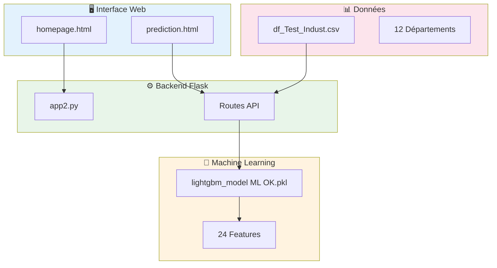
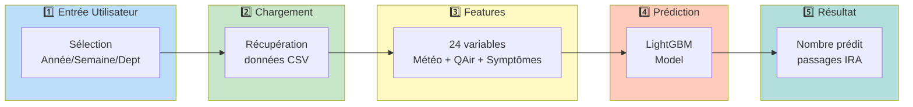

# 🏥 PREDICTIRA - Prédiction des Infections Respiratoires Aiguës

<p align="center">
  
</p>

<p align="center">
  
  
  
  
  
</p>

---

## 📋 Description

**PREDICTIRA** est une application web de prédiction des passages aux urgences pour **Infections Respiratoires Aiguës (IRA)** dans la région Auvergne-Rhône-Alpes. Elle utilise un modèle de Machine Learning (LightGBM) entraîné sur des données météorologiques, de qualité de l'air et de tendances de recherche Google.

> 🎯 **Objectif** : Aider les hôpitaux à anticiper les pics d'affluence pour mieux gérer leurs effectifs et ressources.

---

## 🏗️ Architecture du Système



---

## 🔄 Pipeline de Prédiction



---

## 🛠️ Technologies Utilisées

| Composant | Technologie | Description |
|-----------|-------------|-------------|
| **Backend** | Flask | Framework web Python |
| **ML Model** | LightGBM | Gradient Boosting optimisé |
| **Frontend** | Bootstrap 5 | Interface responsive |
| **Data** | Pandas, NumPy | Manipulation des données |
| **API** | Flask-CORS | Gestion des requêtes cross-origin |

---

## 📊 Features du Modèle (24 variables)

### Symptômes Google Trends (12)
| Code | Symptôme |
|------|----------|
| SYM1 | Douleur thoracique |
| SYM3 | Essoufflement |
| SYM5 | Nausées |
| SYM6 | Vomissements |
| SYM8 | Palpitations |
| SYM22 | Faiblesse |
| SYM23 | Toux |
| SYM29 | Sifflements |
| SYM31 | Production de mucus |
| SYM34 | Maux de tête |
| SYM35 | Perte d'appétit |
| SYM68 | Frissons |

### Qualité de l'Air (6)
| Variable | Description |
|----------|-------------|
| average_Co | Monoxyde de carbone |
| average_No_2 | Dioxyde d'azote |
| average_O_3 | Ozone |
| average_Pm_2_5 | Particules fines PM2.5 |
| average_So_2 | Dioxyde de soufre |
| average_IQA_global | Indice qualité air global |

### Météo & Autres (6)
| Variable | Description |
|----------|-------------|
| avg_pressure | Pression atmosphérique moyenne |
| avg_temperature_max | Température max moyenne |
| indice | Indice grippe (Sentinelles) |
| dept | Code département |
| week_cos | Encodage cyclique semaine |
| year | Année |

---

## 🗺️ Départements Couverts

| Code | Département |
|------|-------------|
| 01 | Ain |
| 03 | Allier |
| 07 | Ardèche |
| 15 | Cantal |
| 26 | Drôme |
| 38 | Isère |
| 42 | Loire |
| 43 | Haute-Loire |
| 63 | Puy-de-Dôme |
| 69 | Rhône |
| 73 | Savoie |
| 74 | Haute-Savoie |

---

## 📁 Structure du Projet

```
PREDICTIRA/
│
├── 📂 static/
│   ├── css/
│   │   ├── bootstrap.min.css
│   │   └── style.css
│   └── images/
│       ├── image.png
│       └── logo3.png
│
├── 📂 templates/
│   ├── homepage.html          # Page d'accueil
│   └── prediction.html        # Interface de prédiction
│
├── 📂 documentation/
│   └── Rapport_FilsRouge.docx # Rapport complet du projet
│
├── 📂 preproc/
│   ├── DF_preprocessing.ipynb # Notebook preprocessing
│   └── ML_modele2_V8.ipynb    # Notebook entraînement modèle
│
├── 📄 app2.py                  # Application Flask principale
├── 📄 featuresExtract.py       # Script extraction features
├── 📄 lightgbm_model ML OK.pkl # Modèle LightGBM entraîné
├── 📄 df_Test_Indust.csv       # Données de test
├── 📄 listeFeatures.txt        # Liste des 24 features
├── 📄 departement.txt          # Liste des départements
├── 📄 requirements.txt         # Dépendances Python
└── 📄 README.md
```

---

## 🚀 Installation

### Prérequis
- Python 3.8+
- pip

### Étapes

```bash
# 1. Cloner le repository
git clone https://github.com/MohdSarar/PREDICTIRA.git
cd PREDICTIRA

# 2. Créer un environnement virtuel
python -m venv venv
source venv/bin/activate  # Linux/Mac
# ou
venv\Scripts\activate     # Windows

# 3. Installer les dépendances
pip install -r requirements.txt

# 4. Lancer l'application
python app2.py
```

### Accéder à l'application
Ouvrir dans le navigateur : `http://127.0.0.1:5000/`

---

## 💡 Utilisation

### 1. Page d'accueil
Présentation du projet et accès à l'interface de prédiction.

### 2. Interface de prédiction
1. **Sélectionner** l'année, la semaine et le département
2. **Cliquer** sur "Valider" pour charger les données
3. **Modifier** les valeurs si nécessaire
4. **Cliquer** sur "Prédire" pour obtenir le résultat

### 3. Résultat
Le modèle retourne le **nombre prédit de passages aux urgences pour IRA**.

---

## 📈 Performances du Modèle

| Métrique | Score |
|----------|-------|
| **R² Score** | 0.87 |
| **RMSE** | ~18 passages |

---

## 📚 Documentation

### Notebooks (dossier `preproc/`)

| Fichier | Description |
|---------|-------------|
| `DF_preprocessing.ipynb` | Preprocessing des données, feature engineering, agrégation hebdomadaire |
| `ML_modele2_V8.ipynb` | Entraînement LightGBM, benchmark modèles, optimisation hyperparamètres |

### Rapport
Le rapport complet du projet est disponible dans `documentation/Rapport_FilsRouge.docx`.

---

## 🔮 Évolutions Futures

- [ ] 🌍 Extension à d'autres régions françaises
- [ ] 📱 Application mobile
- [ ] 🔗 API REST publique
- [ ] 📊 Dashboard temps réel (Streamlit)

---

## 👥 Équipe Projet

Projet réalisé dans le cadre du **Projet Fil Rouge** - Centre de formation **M2I**

Mohammed ABUSARAR
Sarra ABBASSI 
Patrice DUCLOS 
Yannick REPILLEZ

---

## 📧 Contact

- **GitHub** : [M2IFormationHopital](https://github.com/M2IFormationHopital)
- **Email** : m2iformationhopital@gmail.com

---

## 📄 Licence

Distribué sous la licence MIT. Voir `LICENSE` pour plus d'informations.

---

<p align="center">
  <i>🏥 PREDICTIRA - Anticiper pour mieux soigner</i>
</p>
