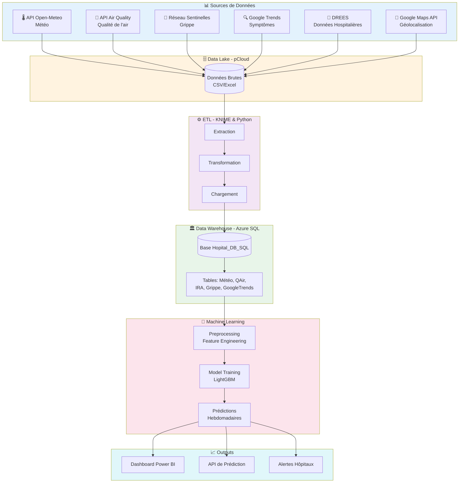
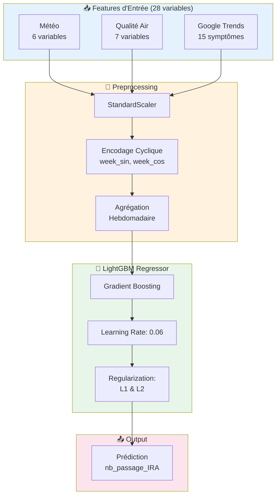

# 🏥 PREDICTIRA - Prédiction des Infections Respiratoires Aiguës

<p align="center">
  
  
  
  
  
</p>

## 📋 Description

**PREDICTIRA** est une solution complète d'aide à la décision pour les hôpitaux, permettant de **prédire les admissions aux urgences pour Infections Respiratoires Aiguës (IRA)**. Ce projet vise à anticiper les pics d'affluence hospitalière en croisant des données météorologiques, de qualité de l'air, épidémiologiques et de tendances de recherche.

> 🎯 **Objectif** : Permettre aux hôpitaux d'adapter leurs effectifs et ressources en anticipant les flux de patients souffrant de maladies respiratoires.

---

## 🌟 Problématique

Face aux difficultés croissantes du système de santé français, les hôpitaux sont confrontés à :
- Des **pics d'admissions imprévisibles** lors d'épisodes de pollution ou viraux
- Une **gestion difficile des effectifs** du personnel soignant
- Un **parcours patient dégradé** lors des périodes de forte affluence

PREDICTIRA apporte une solution en fournissant des **prédictions hebdomadaires** des admissions IRA, permettant une gestion proactive des ressources hospitalières.

---

## 🏗️ Architecture du Système



---

## 🔄 Pipeline de Données

```mermaid
flowchart LR
    subgraph Collection["1️⃣ Collecte"]
        A[APIs Externes] --> B[Scripts Python]
        B --> C[Fichiers CSV]
    end

    subgraph Storage["2️⃣ Stockage"]
        C --> D[Data Lake<br/>pCloud]
        D --> E[Azure SQL<br/>Database]
    end

    subgraph Processing["3️⃣ Traitement"]
        E --> F[KNIME ETL]
        F --> G[Nettoyage &<br/>Agrégation]
    end

    subgraph ML["4️⃣ ML Pipeline"]
        G --> H[Feature<br/>Engineering]
        H --> I[Standardization]
        I --> J[LightGBM<br/>Training]
    end

    subgraph Predict["5️⃣ Prédiction"]
        J --> K[Modèle .pkl]
        K --> L[Prédictions<br/>IRA]
    end

    style Collection fill:#bbdefb
    style Storage fill:#c8e6c9
    style Processing fill:#fff9c4
    style ML fill:#f8bbd9
    style Predict fill:#b2dfdb
```



---

## 🛠️ Technologies Utilisées

### Data Engineering
| Composant | Technologie | Description |
|-----------|-------------|-------------|
| **Data Lake** | pCloud (Suisse) | Stockage sécurisé AES-256, ISO 27001 |
| **Data Warehouse** | Azure SQL Database | Base relationnelle cloud Microsoft |
| **ETL** | KNIME + Python | Orchestration des flux de données |
| **APIs** | Open-Meteo, Google Maps | Collecte de données externes |

### Machine Learning
| Composant | Technologie | Description |
|-----------|-------------|-------------|
| **Preprocessing** | Pandas, NumPy | Nettoyage et transformation |
| **Feature Engineering** | scikit-learn | Standardisation, encodage cyclique |
| **Modèle Principal** | LightGBM | Gradient Boosting optimisé |
| **Modèles Testés** | RandomForest, XGBoost, SVR, Ridge | Benchmark comparatif |
| **Visualisation** | Matplotlib, Seaborn, Power BI | Analyse et dashboards |

### Infrastructure
| Composant | Technologie | Description |
|-----------|-------------|-------------|
| **Gestion de Projet** | JIRA (Scrum) | Méthodologie Agile |
| **Documentation** | Confluence | Wiki collaboratif |
| **Base de Données** | SQL Server (SSMS) | Administration locale |
| **VPN** | NordVPN | Contournement rate-limiting APIs |

---

## 📊 Sources de Données

### 1. 🌡️ Données Météorologiques
- **Source** : Open-Meteo API
- **Variables** : Température (min/max/moy), Précipitations, Vent, Pression
- **Granularité** : Journalière → Agrégée hebdomadaire
- **Couverture** : Tous les départements de France (2020-2024)

### 2. 💨 Qualité de l'Air
- **Source** : Open-Meteo Air Quality API
- **Polluants** : PM2.5, PM10, NO₂, O₃, SO₂, CO
- **Index** : IQA Global (calculé selon seuils officiels)
- **Couverture** : 35,000+ communes françaises

### 3. 🦠 Données Épidémiologiques
- **Grippe** : Réseau Sentinelles (Santé Publique France)
- **IRA** : DREES - Enquête Urgences
- **Granularité** : Hebdomadaire par département
- **Historique** : 2010-2024

### 4. 🔍 Google Trends
- **Symptômes suivis** : 18 symptômes liés aux IRA
- **Exemples** : Toux, Fièvre, Mal de gorge, Essoufflement
- **Région** : Auvergne-Rhône-Alpes
- **Corrélation** : Détection précoce des pics épidémiques

### 5. 🏥 Données Hospitalières
- **Source** : DREES (Ministère de la Santé)
- **Données** : Passages aux urgences, Admissions
- **Couverture** : 6 années de données (CHU Lyon, Grenoble, etc.)

---

## 🧠 Modèle de Machine Learning

### Architecture du Modèle



### Hyperparamètres Optimisés

```python
params = {
    'boosting_type': 'gbdt',
    'learning_rate': 0.06,
    'max_depth': -1,
    'min_child_samples': 20,
    'n_estimators': 500,
    'reg_alpha': 0.1,      # L1 regularization
    'reg_lambda': 0.1,     # L2 regularization
    'num_leaves': 31,
    'early_stopping_rounds': 50
}
```

### Performances du Modèle

| Métrique | Entraînement | Test | Industrialisation |
|----------|--------------|------|-------------------|
| **R² Score** | 0.92 | 0.87 | 0.85 |
| **MSE** | 245 | 312 | 340 |
| **RMSE** | 15.6 | 17.7 | 18.4 |
| **MAE** | 11.2 | 13.8 | 14.5 |

### Benchmark des Modèles Testés

| Modèle | R² Score | MSE | Temps (s) |
|--------|----------|-----|-----------|
| **LightGBM** ⭐ | **0.87** | **312** | 2.3 |
| Gradient Boosting | 0.85 | 348 | 8.7 |
| Random Forest | 0.82 | 401 | 5.2 |
| XGBoost | 0.84 | 365 | 4.1 |
| Ridge Regression | 0.71 | 589 | 0.3 |
| Linear Regression | 0.68 | 645 | 0.2 |

---

## 📁 Structure du Projet

```
PREDICTIRA/
├── 📂 data/
│   ├── raw/                    # Données brutes (CSV, Excel)
│   ├── processed/              # Données nettoyées
│   └── external/               # Données APIs externes
│
├── 📂 preproc/
│   ├── DF_preprocessing.ipynb  # Notebook de preprocessing
│   └── feature_engineering.py  # Scripts de features
│
├── 📂 models/
│   ├── ML_modele2_V8.ipynb    # Notebook d'entraînement
│   ├── lightgbm_model.pkl     # Modèle sauvegardé
│   └── standard_scaler.pkl    # Scaler sauvegardé
│
├── 📂 etl/
│   ├── knime_workflows/       # Workflows KNIME
│   ├── sql_scripts/           # Scripts SQL
│   └── python_etl/            # Scripts Python ETL
│
├── 📂 api_collectors/
│   ├── meteo_collector.py     # Collecteur météo
│   ├── qair_collector.py      # Collecteur qualité air
│   ├── google_trends.py       # Collecteur Google Trends
│   └── grippe_collector.py    # Collecteur grippe
│
├── 📂 docs/
│   ├── Rapport_FilsRouge.docx # Rapport complet du projet
│   └── architecture.md        # Documentation technique
│
├── 📂 visualization/
│   └── powerbi/               # Dashboards Power BI
│
├── requirements.txt           # Dépendances Python
├── .env.example              # Template variables d'environnement
└── README.md                 # Ce fichier
```

---

## 🚀 Installation

### Prérequis

- Python 3.8+
- SQL Server / Azure SQL Database
- KNIME Analytics Platform (optionnel)
- Compte pCloud (optionnel pour Data Lake)

### Installation des dépendances

```bash
# Cloner le repository
git clone https://github.com/MohdSarar/PREDICTIRA.git
cd PREDICTIRA

# Créer un environnement virtuel
python -m venv venv
source venv/bin/activate  # Linux/Mac
# ou
venv\Scripts\activate     # Windows

# Installer les dépendances
pip install -r requirements.txt
```

### Configuration

```bash
# Copier le fichier de configuration
cp .env.example .env

# Éditer les variables d'environnement
nano .env
```

```env
# Database Configuration
DB_SERVER=your-server.database.windows.net
DB_NAME=Hopital_DB_SQL
DB_USER=your_username
DB_PASSWORD=your_password

# API Keys (optionnel)
GOOGLE_MAPS_API_KEY=your_key
```

---

## 💡 Utilisation

### 1. Preprocessing des données

```bash
cd preproc
jupyter notebook DF_preprocessing.ipynb
```

### 2. Entraînement du modèle

```bash
cd models
jupyter notebook ML_modele2_V8.ipynb
```

### 3. Prédiction sur nouvelles données

```python
import joblib
import pandas as pd

# Charger le modèle et le scaler
model = joblib.load('models/lightgbm_model.pkl')
scaler = joblib.load('models/standard_scaler.pkl')

# Charger les nouvelles données
df = pd.read_csv('data/new_data.csv')

# Preprocessing
X = preprocess_features(df)
X_scaled = scaler.transform(X)

# Prédiction
predictions = model.predict(X_scaled)
print(f"Prédiction IRA: {predictions}")
```

---

## 📈 Résultats et Impact

### Capacités de Prédiction

- ✅ **Anticipation à 1 semaine** des pics d'admissions IRA
- ✅ **Précision de 87%** (R² Score) sur les données de test
- ✅ **Couverture régionale** : Auvergne-Rhône-Alpes (12 départements)
- ✅ **Données temps réel** via APIs météo et qualité de l'air

### Bénéfices pour les Hôpitaux

| Aspect | Amélioration |
|--------|--------------|
| **Gestion des effectifs** | Planification proactive des équipes |
| **Flux patients** | Réduction des temps d'attente |
| **Ressources** | Optimisation des lits et matériels |
| **Qualité de soins** | Meilleure prise en charge |

---

## 👥 Équipe Projet

Ce projet a été réalisé dans le cadre du **Projet Fil Rouge** au centre de formation **M2I**.

| Rôle | Responsabilités |
|------|-----------------|
| **Data Engineer** | Collecte APIs, ETL, Data Lake |
| **Data Analyst** | Exploration, Visualisation, Power BI |
| **ML Engineer** | Modélisation, Optimisation, Déploiement |
| **DBA** | Architecture Azure SQL, SSMS |

---

## 🔮 Évolutions Futures

- [ ] 🌍 Extension à toutes les régions françaises
- [ ] 🤖 Intégration de modèles Deep Learning (LSTM)
- [ ] 📱 Application mobile pour alertes temps réel
- [ ] 🔗 API REST pour intégration SI hospitaliers
- [ ] 📊 Dashboard temps réel avec Streamlit

---

## 📚 Documentation

- 📄 [Rapport Complet du Projet](docs/Rapport_FilsRouge.docx)
- 📊 [Notebooks Jupyter](preproc/)
- 🗄️ [Scripts SQL](etl/sql_scripts/)

---

## 📄 Licence

Ce projet est développé dans un cadre académique. Contactez les auteurs pour toute utilisation commerciale.

---

## 👤 Auteur

**Sarar Mohd** - Data Scientist & ML Engineer

[](https://github.com/MohdSarar)
[](https://linkedin.com/in/your-profile)

---

<p align="center">
  <i>🏥 PREDICTIRA - Anticiper pour mieux soigner</i>
</p>
